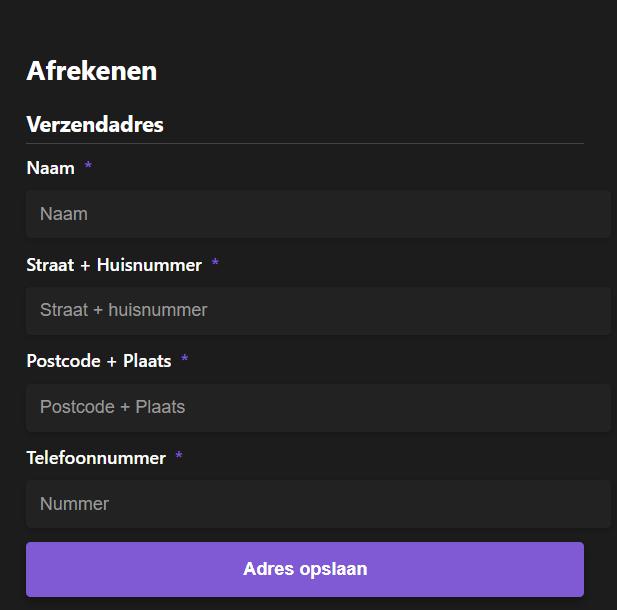
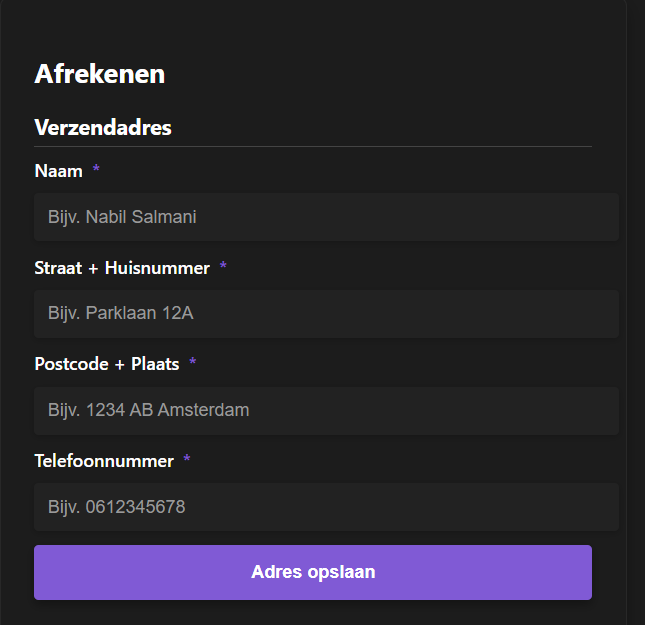
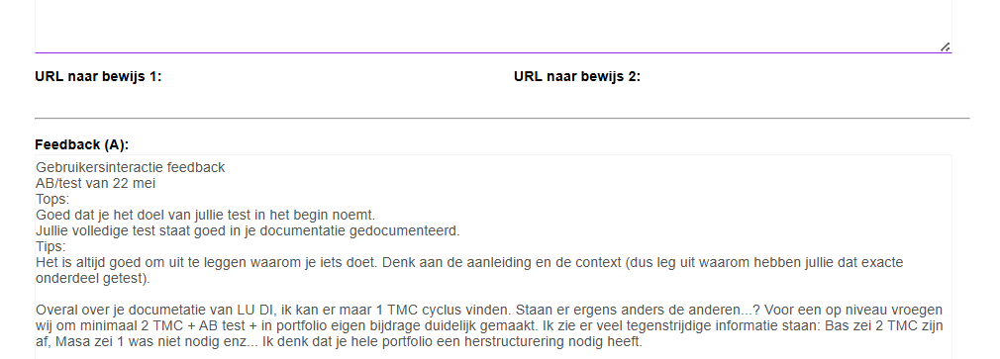

# A/B-test – Placeholdertekst in het veld "Naam"

## Verwijzing naar gezamenlijke projectdocumentatie

Voor meer context en technische details over onze A/B-testaanpak en andere experimenten, zie onze gezamenlijke projectdocumentatie: 

[Link naar andere ab test](https://gitlab.fdmci.hva.nl/propedeuse-hbo-ict/onderwijs/student-projecten/2024-2025/out-a-se-ti/blok-4/laajoowiicoo13/-/blob/main/docs/functioneel/ab_testen.md?ref_type=heads).

## Wat heb ik getest?

Ik heb getest of het helpt om een voorbeeldnaam te tonen in het naamveld van het formulier. In plaats van alleen “Naam” heb ik **“Bijv. Nabil Salmani”** gebruikt als placeholder.

## Waarom dit onderdeel specifiek?

We merkten tijdens eerdere tests en observaties dat sommige gebruikers twijfelden bij het invullen van hun naam. Vooral als er alleen “Naam” stond, vulden sommigen alleen hun voornaam in of sloegen het veld over. Omdat het naamveld het eerste is wat gebruikers zien, is het belangrijk dat ze meteen begrijpen wat er van hen verwacht wordt. Daarom wilden we testen of een voorbeeld (zoals “Bijv. Nabil Salmani”) dat probleem oplost.

**Ontwerpen in Figma:**  
  

## Wat heb ik getest?

Ik heb twee varianten getest:
- **Variant A:** Alleen “Naam”
- **Variant B:** “Bijv. Nabil Salmani”

## Op wie heb ik getest?

Ik heb de test uitgevoerd op **Wail**, **Amin** en **Hermon**.  
Iedereen kreeg beide versies te zien en koos welke zij beter vonden.

## Wat kwam eruit?

Alle drie kozen voor variant B.  
Ze vonden dat meteen duidelijk was dat je je volledige naam moest invullen.  
Variant A was volgens hen te leeg en onduidelijk.

## Wat heb ik hiervan geleerd?

Een voorbeeld maakt het makkelijker voor de gebruiker.  
Mensen begrijpen sneller wat ze moeten doen en maken minder fouten.

## Wat heb ik ermee gedaan?

Ik heb de placeholder aangepast naar “Bijv. Nabil Salmani” in mijn formulier.  
Misschien ga ik dit ook doen bij andere velden, zoals telefoonnummer of postcode.

## Mijn bijdrage aan het team en mijn learning journey

Binnen ons team was dit mijn eerste zelfstandige A/B-test. Ik heb zelf het testidee voorgesteld, de varianten uitgewerkt in Figma, en het testplan opgezet en uitgevoerd. Dit gaf me inzicht in hoe kleine aanpassingen in de user interface een grote impact kunnen hebben op het gebruikersgedrag. Ook leerde ik hoe belangrijk het is om feedback direct van gebruikers te verzamelen en dat zelfs drie kwalitatieve reacties veel kunnen opleveren in een vroege fase.

Door deze ervaring begrijp ik nu beter hoe je hypotheses opstelt, tests uitvoert, en conclusies onderbouwt. Dat neem ik mee in volgende experimenten, waarbij ik ook ga meedenken over hoe we deze aanpak schaalbaar kunnen maken binnen ons project.

## Feedback op de A/B-test

