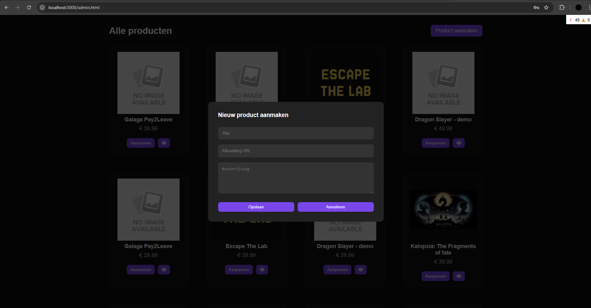
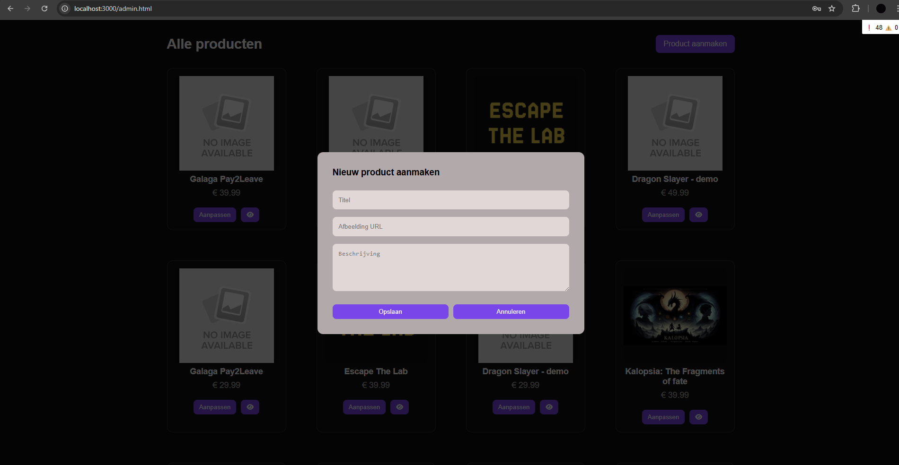

## A/B test presentatie 27/05

| **Testpersonen:** 3 medestudenten & 2 familieleden

---
## **Wat is getest en hoe?**  

Wij hebben 2 verschillende designs gemaakt voor de product overview page, die hebben wij door middel van een presentatie getoond aan de testpersonen. In die presentatie hebben wij de 2 verschillende designs gepresenteerd met onderbouwing, hierna gaven wij de klas de mogelijkheid om te stemmen op welk design zij het mooist vonden.

| **Wat is getest?**  |
|-------------------------|
| **Product overview**             |

---

## 1. **Designs**

Tijdens de A/B-test hebben we twee varianten getest van de **pop-up voor het aanmaken van een nieuw product** in de adminomgeving. De focus lag op leesbaarheid, contrast, en visuele aansluiting bij de rest van de interface.

---

### 🅰️ Design A – Donkere pop-up (consistent met UI)

**Kenmerken**  
Deze versie maakt gebruik van een donkere achtergrondkleur voor de pop-up, wat aansluit bij de bestaande dark mode-styling van de website.

**Voordelen**
- Consistent met de rest van de adminpagina (dark theme).
- Minder fel licht bij het openen van de modal, wat prettiger is voor de ogen.
- De knoppen en invoervelden vallen visueel beter op tegen de donkere achtergrond.

**Nadelen**
- Kan iets minder duidelijk zijn bij fel omgevingslicht of op schermen met slechte helderheid.
- Minder geschikt voor gebruikers die gewend zijn aan lichte interfaces.

---

### 🅱️ Design B – Lichtkleurige pop-up

**Kenmerken**  
In deze versie heeft de pop-up een lichtere, neutrale achtergrondkleur, wat contrasteert met de verder donkere pagina.

**Voordelen**
- Hogere visuele scheiding tussen de pop-up en de achtergrond.
- Mogelijk beter leesbaar op slecht gekalibreerde schermen.
- Lichte kleuren voelen voor sommige gebruikers moderner of "schoner" aan.

**Nadelen**
- Breekt visueel met het dark theme van de rest van de interface.
- Knoppen vallen minder goed op doordat de aandacht wordt getrokken naar de lichte achtergrond.
- Feller voor de ogen, vooral bij langdurig gebruik of in donkere omgevingen.

---

## 2. **Resultaat**

Uit de A/B-test kwam naar voren dat **optie A (donkere pop-up)** de voorkeur had. De meeste gebruikers gaven aan dat het ontwerp rustiger oogt en beter past binnen de bestaande gebruikersinterface. Vooral het behoud van stijlconsistentie werd genoemd als voordeel.  

Daarnaast werd de visuele balans tussen de pop-up en de rest van de adminpagina als prettiger ervaren. De invoervelden en knoppen waren duidelijk zichtbaar, zonder dat de modal te veel afleidde van de content erachter.

**Conclusie:**  
Design A biedt een meer consistente gebruikerservaring binnen de dark-themed omgeving en werd daardoor als prettiger en professioneler ervaren. Deze variant wordt daarom doorgevoerd in het eindontwerp.

---

