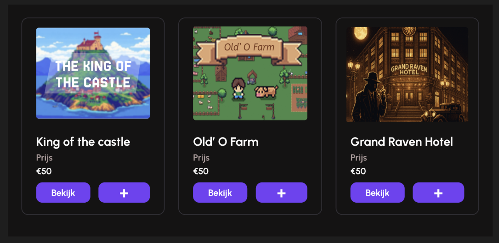
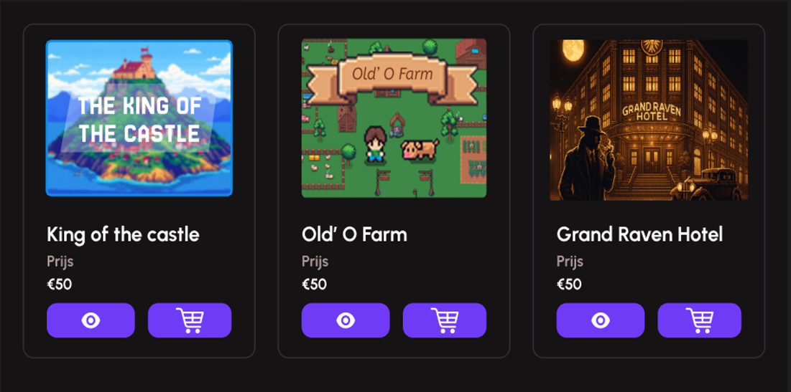

## A/B test presentatie 27/05

| **Testpersonen:** 3 medestudenten & 2 familieleden

---
## **Wat is getest en hoe?**  

Wij hebben 2 verschillende designs gemaakt voor de product overview page, die hebben wij door middel van een presentatie getoond aan de testpersonen. In die presentatie hebben wij de 2 verschillende designs gepresenteerd met onderbouwing, hierna gaven wij de klas de mogelijkheid om te stemmen op welk design zij het mooist vonden.

| **Wat is getest?**  |
|-------------------------|
| **Product overview**             |

---

## **1. Desings**  
### 🅰️ Design A – Tekstgebaseerde knoppen

**Kenmerken**  
In deze versie zijn de primaire knoppen tekstueel aangeduid met “Bekijk” en “+”.

**Voordelen**
- Tekstuele knoppen zijn duidelijk voor gebruikers die minder vertrouwd zijn met iconen.
- De “Bekijk”-knop geeft direct aan wat de actie doet, wat drempelverlagend werkt voor nieuwe bezoekers.

**Nadelen**
- De betekenis van de “+”-knop kan onduidelijk zijn (toevoegen aan winkelmand? favoriet?).
- Minder visueel aantrekkelijk bij kortere buttonlabels.

---

### 🅱️ Design B – Icon-gebaseerde knoppen

**Kenmerken**  
Deze versie maakt gebruik van visuele iconen: een oogje voor bekijken en een winkelwagentje voor toevoegen.

**Voordelen**
- Meer visuele balans door iconen van gelijke grootte.
- De iconen zijn herkenbaar voor gebruikers die gewend zijn aan webshops, wat zorgt voor een modernere look.
- Beter schaalbaar in responsive design, doordat iconen minder ruimte innemen dan tekst.

**Nadelen**
- Voor sommige gebruikers kan het niet direct duidelijk zijn wat de iconen betekenen zonder begeleidende tekst.
- Minder toegankelijk voor gebruikers met visuele beperkingen of beperkte digitale geletterdheid.
---

## **2. Resultaat**  

Uit de A/B-test is gebleken dat **optie B (icon-gebaseerde knoppen)** door de meeste gebruikers als prettiger werd ervaren. Gebruikers gaven aan dat de iconen intuïtiever en visueel aantrekkelijker waren, vooral omdat ze herkenbaar zijn uit andere webshops.  

Daarnaast zorgden de iconen voor een rustigere en meer consistente vormgeving binnen de kaart, wat bijdroeg aan een professionelere uitstraling van de interface.

Hoewel een klein deel van de testpersonen aangaf dat begeleidende tekst misschien nog iets duidelijker zou zijn, vonden de meeste gebruikers dat de gekozen iconen voldoende betekenis overbrachten.

**Conclusie:**  
Design B sluit beter aan bij de verwachtingen van de doelgroep en zal daarom worden toegepast in het definitieve ontwerp.

---

