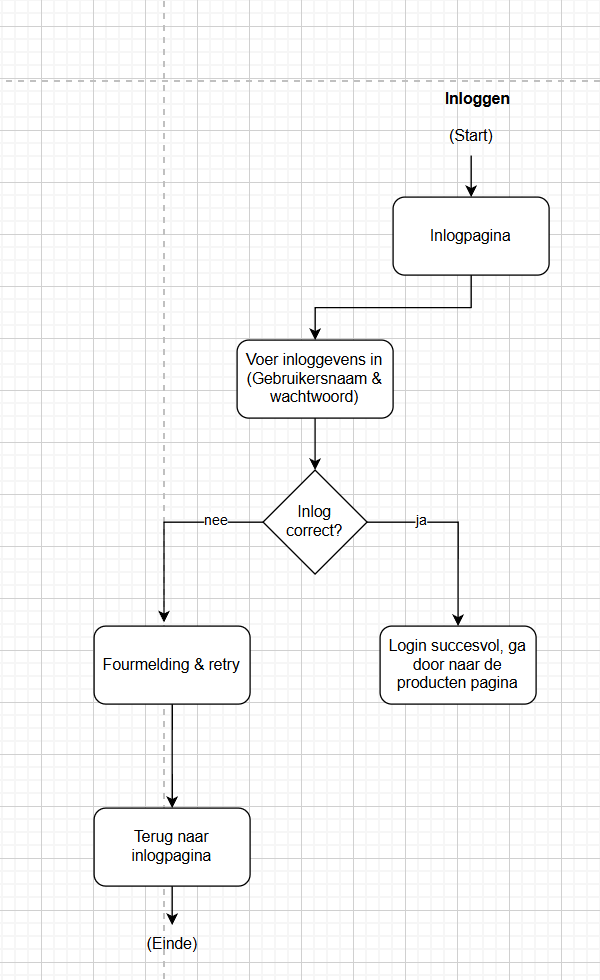
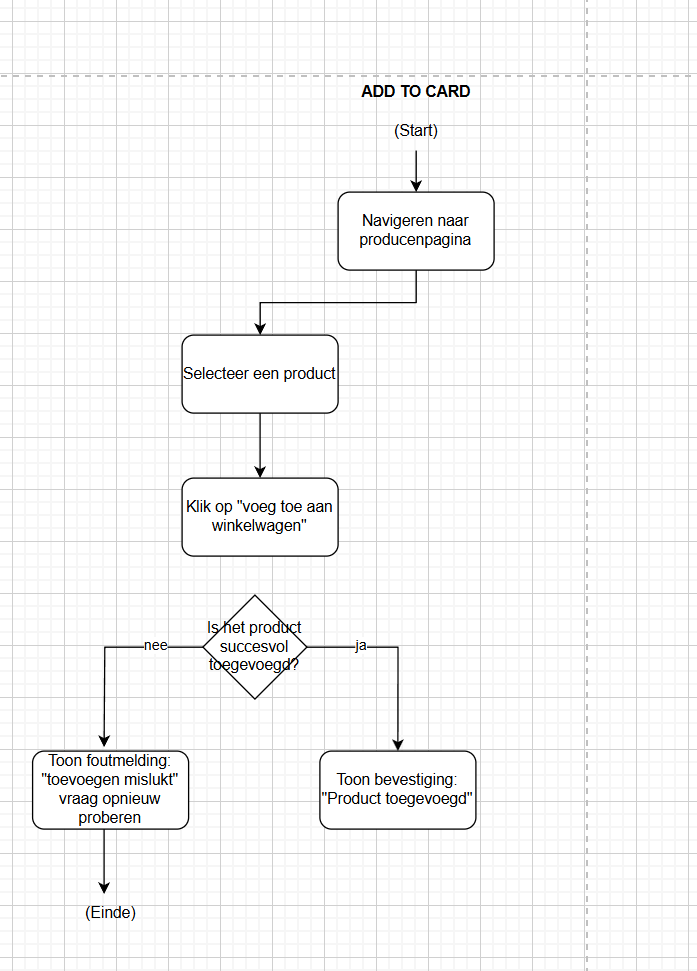
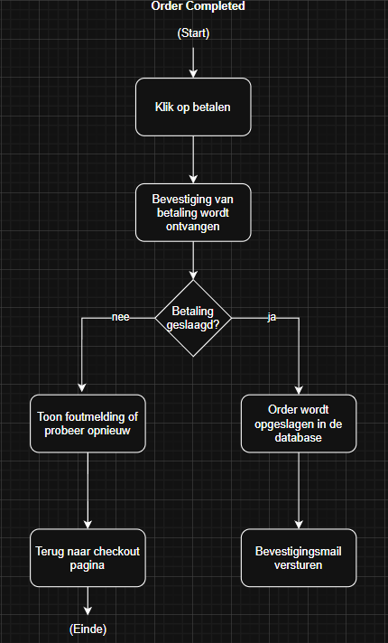
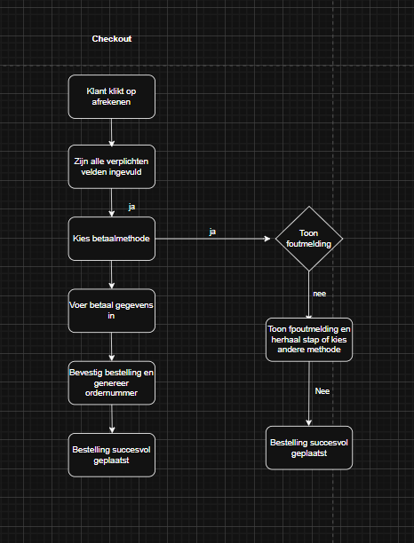

# BPMN Documentatie

In dit document worden de BPMN-diagrammen van Sem, Kevin, Dion, Nedzhet en Nabil beschreven. 

---

## 1. BPMN (Sem): Inloggen

### 1.1 Screenshot

### 1.2 Uitleg
1. **Inlogpagina**  
   De gebruiker komt op de inlogpagina van de website.

2. **Voer inloggegevens in**  
   De gebruiker vult zijn/haar gebruikersnaam en wachtwoord in.

3. **Controle: Inlog correct?**  
   - **Nee**  
     - **Foutmelding & Retry**  
       - Er verschijnt een foutmelding “Inloggen mislukt.”  
       - De gebruiker kan opnieuw proberen in te loggen.  
   - **Ja**  
     - **Login succesvol**  
       - De gebruiker wordt doorgestuurd naar de productenpagina.

---

## 2. BPMN (Sem): Add to Cart

### 2.1 Screenshot

### 2.2 Uitleg
1. **Productenpagina**  
   De gebruiker bekijkt de lijst met beschikbare producten.

2. **Selecteer product**  
   De gebruiker klikt het gewenste product aan om meer details te zien.

3. **Klik op ‘Voeg toe aan winkelwagen’**  
   De gebruiker klikt op de knop om het geselecteerde product aan de winkelwagen toe te voegen.

4. **Controle: Product succesvol toegevoegd?**  
   - **Nee**  
     - **Foutmelding**  
       - “Toevoegen mislukt, probeer opnieuw.”  
   - **Ja**  
     - **Product toegevoegd**  
       - Er verschijnt een melding “Product is toegevoegd aan je winkelwagen.”  

---

## 3. Documentatie Kevin

### 3.1 BPMN van Kevin
*(Plaats hier het BPMN-diagram van Kevin, met bijbehorende uitleg.)*

---

## 4. Documentatie Dion

### 4.1 BPMN van Dion
*(Plaats hier het BPMN-diagram van Dion, met bijbehorende uitleg.)*

---

## 5. Documentatie Nedzhat

### 5.1 BPMN van Nedzhat - Order Complete

#### 6.1.1 Screenshot  

#### 6.1.2 Uitleg  

1. **Klant klikt op afrekenen**  
   De klant besluit af te rekenen en start het checkoutproces.

## 6. Documentatie Nabil

### 6.1 BPMN van Nabil - Checkout

#### 6.1.1 Screenshot  

#### 6.1.2 Uitleg  
1. **Klant klikt op afrekenen**  
   De klant besluit af te rekenen en start het checkoutproces.

2. **Zijn alle verplichte velden ingevuld?**  
   - **Nee**  
     - **Toon foutmelding en herhaal stap of kies andere methode**  
       - Er verschijnt een foutmelding en de klant moet eerst alle verplichte velden invullen.
   - **Ja**  
     - Het proces gaat verder.

3. **Kies betaalmethode**  
   De klant kiest een beschikbare betaalmethode.

4. **Voer betaalgegevens in**  
   De klant vult de betaalgegevens in, zoals IBAN of creditcardgegevens.

5. **Controle: Betaling gelukt?**  
   - **Nee**  
     - **Toon foutmelding**  
       - Er verschijnt een foutmelding dat de betaling is mislukt.  
     - **Toon foutmelding en herhaal stap of kies andere methode**  
       - De klant krijgt de kans om de stap opnieuw te doen of een andere betaalmethode te kiezen.
   - **Ja**  
     - Het proces gaat verder.

6. **Bevestig bestelling en genereer ordernummer**  
   De bestelling wordt bevestigd en er wordt een uniek ordernummer gegenereerd.

7. **Bestelling succesvol geplaatst**  
   De bestelling is succesvol afgerond en wordt verder verwerkt.
