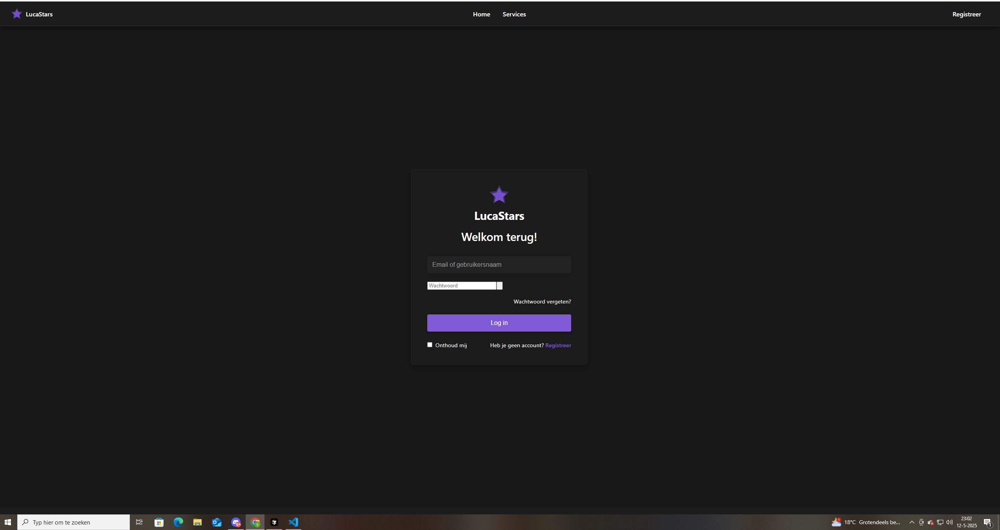

# TMC Sprint 4 - Login Component

## Test Met Collega - Login Functionaliteit

**Datum:** 22-04-2023  
**Component:** Login pagina met "Onthoud mij" functionaliteit

### Vergelijking Ontwerp vs. Implementatie

#### Ontwerp (Figma)
- Modern, clean ontwerp met paarse accentkleur
- Centrale positionering van het login-formulier
- "Onthoud mij" checkbox onder de login-knop
- Wachtwoord vergeten link en registratie-optie aanwezig
- Full-width login velden en knop
- Navigatiebalk bovenaan met LucaStars logo

#### Figma Ontwerp Screenshot

*Figuur 1: Oorspronkelijk Figma ontwerp van de login pagina*

#### Implementatie
- Implementatie volgt grotendeels het ontwerp
- Login-formulier is duidelijk gecentreerd in een container met licht afgeronde hoeken
- Wachtwoordveld heeft passende styling
- "Onthoud mij" functionaliteit is geïmplementeerd
- Navigatiebalk en logo correct geïmplementeerd

#### Implementatie Screenshot

*Figuur 2: De werkelijke implementatie van de login pagina*

### Testresultaten per gebruiker

#### Testpersoon 1: Geneeskunde student, 21 jaar
**Technische ervaring:** Basiskennis van webapplicaties, dagelijkse computergebruiker

##### Positieve punten:
1. ✅ Design is aantrekkelijk en makkelijk te begrijpen
2. ✅ "Onthoud mij" functionaliteit werd meteen opgemerkt en gebruikt
3. ✅ Vond het inlogproces snel.

##### Verbeterpunten:
1. ❌ Was niet zeker of het inloggen was gelukt vanwege de snelle redirect
2. ❌ Vond de "Wachtwoord vergeten" link wat klein

#### Testpersoon 2: ICT-professional, 35 jaar
**Technische ervaring:** Dagelijks bezig met frontend-ontwikkeling, hoge digitale geletterdheid

##### Positieve punten:
1. ✅ Waardeert de clean code en nette implementatie van componenten
2. ✅ Goede validatie van invoervelden

##### Verbeterpunten:
1. ❌ Kleine kleurverschillen tussen ontwerp en implementatie opgemerkt
2. ❌ raadde aan het toevoegen van keyboard accessibility features
3. ❌ Miste hover states op de interactieve elementen

#### Testpersoon 3: Oudere gebruiker, 52 jaar
**Technische ervaring:** Beperkte ervaring met computers, gebruikt voornamelijk e-mail en nieuwswebsites

##### Positieve punten:
1. ✅ Duidelijke aanwijzingen voor wat ingevuld moet worden
2. ✅ Groot genoeg lettertype, goed leesbaar
3. ✅ "Onthoud mij" functie werd zeer gewaardeerd

##### Verbeterpunten:
1. ❌ Zou iets meer contrast willen zien tussen achtergrond en formulier

### Algemene Feedback

#### Positieve punten:
1. ✅ Visueel aantrekkelijk ontwerp dat consistent is met de huisstijl
2. ✅ De login-flow is snel en gebruiksvriendelijk
3. ✅ "Onthoud mij" functionaliteit werkt correct
4. ✅ De error states zijn duidelijk wanneer verkeerde gegevens worden ingevoerd
5. ✅ De responsiveness van het formulier is goed op verschillende schermformaten

#### Verbeterpunten:
1. ❌ De input-velden in de implementatie missen de subtiele schaduw die in het Figma-ontwerp te zien is
2. ❌ De paarse kleur van de login-knop in de implementatie lijkt iets lichter dan in het ontwerp
3. ❌ Het logo van LucaStars in de header is groter in de implementatie dan in het originele ontwerp
4. ❌ De "Wachtwoord vergeten?" link zou groter en opvallender kunnen zijn voor oudere gebruikers
5. ❌ Het contrast tussen de achtergrond en het formuliergedeelte zou sterker kunnen voor betere toegankelijkheid

### Aanbevelingen

1. **Visuele consistentie:** Pas de kleuren en schaduwen aan om exact overeen te komen met het Figma ontwerp
2. **Toegankelijkheid:** Verbeter het contrast en vergroot belangrijke links voor oudere gebruikers
3. **Gebruikersfeedback:** Maak foutmeldingen langer zichtbaar voor gebruikers die langzamer lezen
4. **Animaties:** Voeg subtiele hover/focus animaties toe voor betere interactiviteit
5. **Keyboard navigatie:** Verbeter de focus states voor gebruikers die geen muis gebruiken

