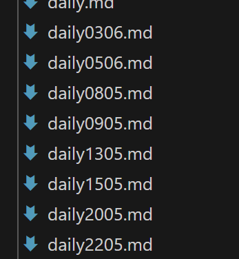

# Project Retrospective Sprint 6 – (Team 8)

## Teamleden
- Sem 
- Kevin
- Nezdhat
- Nabil
- Dion

## Aanwezigheidslijst
- Sem
- Kevin
- Nezdhat
- Nabil
- Dion

## Datum
13-06-2025

## Procesmatige Evaluatie

### Wat ging goed?

#### Communicatie & Samenwerking
- Ten opzichte van vorige sprint zijn de daily standups beter gestructureerd en gedocumenteerd tijdens schooluren
- Team communicatie verloopt soepel via Discord
- Alle teamleden zijn consistent aanwezig geweest

#### Procesverbeteringen
- Ten opzichte van vorige sprint zijn we veel eerder begonnen met deployen (niet meer last-minute)
- Betere planning van merge-momenten dan in sprint 5
- Duidelijkere taakverdeling met specifieke deadlines

#### Product Ontwikkeling
- Product bestelproces is nu volledig functioneel en verloopt vloeiend
- PO afspraken zijn volledig nagekomen
- De flow van de website is significant verbeterd ten opzichte van sprint 5

### Wat kon beter?

#### Procesmatige Aspecten
- Documentatie van daily standups kan nog gestructureerder
- Merge-momenten kunnen nog beter gepland worden
- Taakverdeling kan nog efficiënter

## Verbeterpunten voor de Toekomst

### Procesverbeteringen
- Gestructureerde standup documentatie blijven gebruiken
- Vaste merge-momenten blijven inplannen
- Duidelijke taakverdeling matrix blijven hanteren

### Communicatie
- Standup documentatie blijven verbeteren
- Wekelijkse voortgangsrapportages blijven maken
- Feedback momenten blijven inplannen

### Technische Planning
- Deployment schema blijven volgen
- Code review proces blijven uitvoeren
- Test strategie blijven toepassen

## Bewijs van Implementatie

